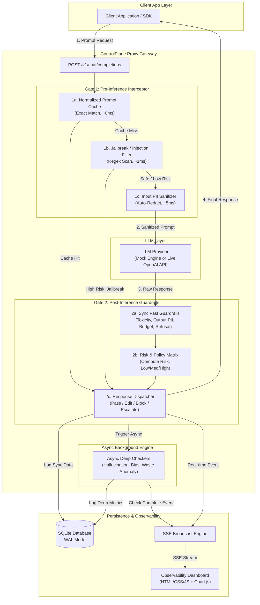

# ControlPlane.ai — Architecture & Data Flow Overview

> **Document Purpose:** Comprehensive breakdown of system architecture, data flow, completed milestones, and the architectural evolution of ControlPlane.ai.

---

## 1. Architectural Evolution Confirmation

> [!IMPORTANT]
> **Architectural Shift Confirmed:** Yes, significant structural changes were made after the initial prototype version. 

### Initial Version (v1) — Single-Stage Post-Inference Proxy
* **Flow:** `App Request` → `LLM Call` → `Post-Inference Sync Guardrails` → `Policy Action` → `App Response` → `Async Background Checks`.
* **Drawbacks:**
  1. **Token Cost Waste:** Identical or repetitive prompts called the LLM provider every time.
  2. **Privacy Risks:** Sensitive user PII contained in input prompts was transmitted to external LLM providers before any check occurred.
  3. **Security Vulnerability:** Jailbreak and prompt-injection attacks reached the LLM engine directly.

### Current Version (v2) — 2-Gate Interceptor Architecture
To solve these limitations, the backend pipeline was refactored into a **2-Gate Architecture**:
* **Gate 1 (Pre-Inference Interceptor):** Executes *before* calling the LLM. Intercepts queries to check cache (0ms / $0 cost), scan and block jailbreak attacks, and sanitize input PII before forwarding.
* **Gate 2 (Post-Inference Guardrails):** Executes *after* receiving the LLM output. Evaluates toxicity, output PII, confidence, and cost thresholds, returning a fast policy decision (`pass`, `flag`, `edit`, `block`, `escalate`).

---

## 2. Summary of Work Done

We built **ControlPlane.ai**, a real-time AI observability and security guardrails proxy sitting between client applications and LLM providers (e.g., OpenAI API or Mock LLM).

### Key Features Implemented:
1. **Core Gateway Proxy (`proxy.py`):**
   - OpenAI-compatible `/v1/chat/completions` endpoint.
   - Dual execution mode: **Live** (forwarding to OpenAI API) and **Mock** (13 built-in demo scenarios).
   - High-throughput async pipeline with Server-Sent Events (SSE) broadcasting.

2. **3-Dimensional Evaluation Engine:**
   - ⚡ **Performance (`checkers/performance.py`):** Confidence scoring, refusal detection, hallucination heuristics (fake DOIs, overconfident claims).
   - 💰 **Cost (`checkers/cost.py`):** Exact-match prompt caching, token budget tracking, multi-model pricing estimation (GPT-4, GPT-4o, GPT-3.5), duplicate query waste detection.
   - 🛡️ **Responsibility (`checkers/responsibility.py` & `checkers/gate1.py`):** Input & output PII detection/redaction (SSNs, credit cards, emails, phone numbers), jailbreak/prompt-injection blocking, toxicity screening, demographic bias detection, system prompt leakage protection.

3. **Policy Engine (`policy.py`):**
   - Multi-risk scoring matrix combining metrics across all three dimensions.
   - Dynamic action assignment: `pass`, `flag`, `edit` (auto-redaction), `block`, `escalate` (queued for human review).

4. **Persistence & Telemetry Layer (`database.py` & `api.py`):**
   - SQLite backend with Write-Ahead Logging (WAL) mode for low-latency concurrent writes.
   - REST API endpoints for telemetry stats, request feeds, detailed check breakdowns, and human review actions (`/api/requests/{id}/action`).

5. **Real-Time Observability Dashboard (`dashboard/`):**
   - Modern, high-density dark UI with glassmorphism ("Matcha" design system brief in `redesign/`).
   - Live SSE feed, SVG gauge rings for dimension risk levels, Chart.js analytics (cost trends, risk distribution, top triggered flags), and interactive human review modal.

6. **Automated Traffic Simulator (`demo.py`):**
   - 13 distinct real-world test cases covering safe queries, PII leaks, hallucinated citations, toxic content, prompt injections, demographic bias, token bloat, and redundant queries.

---

## 3. High-Level Architecture



---

## 4. Detailed Data Flow

### Step 1: Request Interception
The client sends an OpenAI-formatted payload (`POST /v1/chat/completions`) to the ControlPlane proxy.

### Step 2: Gate 1 — Pre-Inference Checks
1. **Cache Check (`gate1.check_cache`):**
   - Prompt text is normalized (lowercased, punctuation stripped, whitespace collapsed).
   - If an exact match exists in the memory cache:
     - **Action:** Return cached response immediately.
     - **Cost:** $0, **Latency:** ~0ms.
     - **Bypasses LLM call entirely.**
2. **Jailbreak Filter (`gate1.check_jailbreak`):**
   - Input prompt scanned against jailbreak & prompt injection regex patterns (e.g., `"ignore previous instructions"`, `"DAN mode"`).
   - If high risk detected:
     - **Action:** Immediately return a `block` response to caller.
     - **Bypasses LLM call.**
3. **Input PII Redaction (`gate1.redact_pii_in_prompt`):**
   - Scans prompt for sensitive data (SSN, credit card, email, phone numbers).
   - Replaces matched strings with tags like `<REDACTED_SSN>`.
   - Passes sanitized prompt to LLM.

### Step 3: LLM Execution
The proxy forwards the sanitized prompt to the target LLM provider (or simulates a response in mock mode).

### Step 4: Gate 2 — Post-Inference Checks & Policy Decision
1. **Synchronous Guardrails:**
   - **Output PII:** Checks LLM output for leaked sensitive data.
   - **Toxicity:** Scans output for harmful/violent content.
   - **Token Budget:** Verifies token count against pre-set cost limits.
   - **Refusal Detection:** Detects empty responses or refusal phrases.
2. **Policy Engine (`policy.evaluate`):**
   - Aggregates scores across Performance, Cost, and Responsibility.
   - Determines **Overall Risk** (`low`, `medium`, `high`) and **Policy Action**:
     - `pass`: Response safe, forward as-is.
     - `edit`: Auto-redact output PII before returning.
     - `block`: Replace output with safety block message.
     - `escalate`: Return flagged response and queue in UI for human approval.

### Step 5: Client Response & Async Telemetry
1. The proxy dispatches the final response to the client application (average sync latency: <20ms overhead).
2. **Sync metrics** are written to SQLite and broadcast via SSE to the dashboard.
3. **Async Deep Checkers** run in background task queue:
   - Deep hallucination heuristics & citation matching.
   - Demographic bias detection.
   - Multi-request cost anomaly and duplicate waste scoring.
4. Async results update SQLite records and trigger an `async_checks_complete` SSE event to update dashboard cards dynamically.

---

## 5. System File Directory & Architecture Map

| File Path | Role & Functionality |
| :--- | :--- |
| [`controlplane/main.py`](file:///e:/aic/prototype/aic/controlplane/main.py) | Entry point for FastAPI application. Initializes DB, mounts `/dashboard` static files, registers endpoints. |
| [`controlplane/proxy.py`](file:///e:/aic/prototype/aic/controlplane/proxy.py) | Gateway proxy engine executing the 2-Gate pipeline, cache lookups, mock/live LLM dispatch, and SSE broadcasting. |
| [`controlplane/policy.py`](file:///e:/aic/prototype/aic/controlplane/policy.py) | Risk-action matrix engine. Translates check scores into risk levels (`low`/`medium`/`high`) and policy actions (`pass`/`flag`/`edit`/`block`/`escalate`). |
| [`controlplane/config.py`](file:///e:/aic/prototype/aic/controlplane/config.py) | Central system configuration: model pricing tables, cost/risk thresholds, and operational mode flags (`mock` vs `live`). |
| [`controlplane/database.py`](file:///e:/aic/prototype/aic/controlplane/database.py) | SQLite interface using WAL mode. Manages `requests` and `checks` tables, metrics aggregation, and human review updates. |
| [`controlplane/api.py`](file:///e:/aic/prototype/aic/controlplane/api.py) | REST API router (`/api/stats`, `/api/requests`, `/api/requests/{id}/action`) and SSE endpoint (`/api/stream`). |
| [`controlplane/checkers/gate1.py`](file:///e:/aic/prototype/aic/controlplane/checkers/gate1.py) | Pre-Inference Interceptor checks: Normalized string cache, Jailbreak filter, Input PII regex redaction. |
| [`controlplane/checkers/performance.py`](file:///e:/aic/prototype/aic/controlplane/checkers/performance.py) | Performance dimension checkers: confidence analysis, refusal detection, hallucination heuristics. |
| [`controlplane/checkers/cost.py`](file:///e:/aic/prototype/aic/controlplane/checkers/cost.py) | Cost dimension checkers: token budget limits, model cost estimation, duplicate query waste scoring. |
| [`controlplane/checkers/responsibility.py`](file:///e:/aic/prototype/aic/controlplane/checkers/responsibility.py) | Responsibility dimension checkers: output PII detection/redaction, toxicity screening, demographic bias, prompt exposure. |
| [`controlplane/demo.py`](file:///e:/aic/prototype/aic/controlplane/demo.py) | Traffic simulator with 13 comprehensive test scenarios for demonstration and testing. |
| [`controlplane/dashboard/`](file:///e:/aic/prototype/aic/controlplane/dashboard/) | Frontend static files (`index.html`, `style.css`, `app.js`) delivering the real-time observability UI. |

---

## 6. How to Run the Application

```bash
# 1. Navigate to the project root directory
cd e:/aic/prototype/aic

# 2. Install dependencies (if not already installed)
pip install -r requirements.txt

# 3. Launch the ControlPlane server
python -m controlplane.main

# 4. Access the Observability Dashboard
# Open browser at: http://localhost:8000/

# 5. Run simulated traffic (in a separate terminal)
python -m controlplane.demo
```
