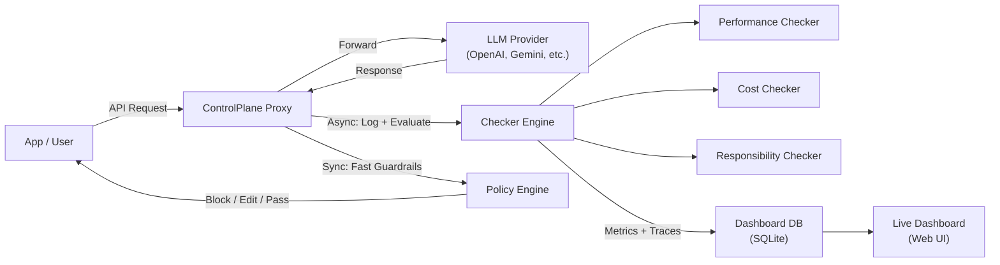
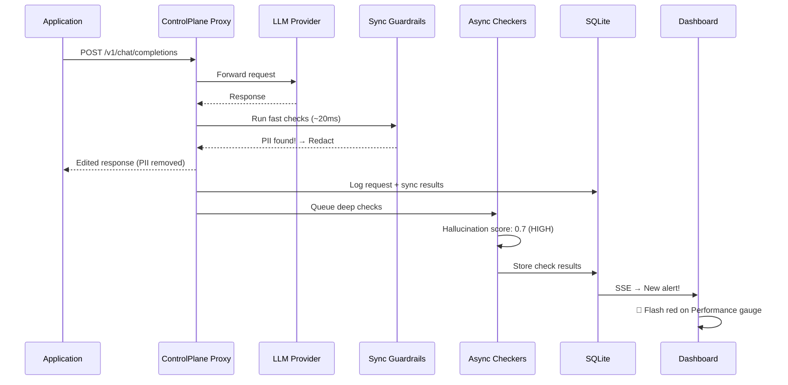

# ControlPlane.ai — Working Prototype Implementation Plan

## Problem Summary

**ControlPlane Checker** is a technology layer that sits on top of any AI model and continuously observes every AI response in **real time** across three dimensions:

| Dimension | What It Catches |
|:---|:---|
| **Performance** | Hallucinations, confidently wrong answers, low-quality responses |
| **Cost** | Excessive token usage, unnecessary retries, compute waste |
| **Responsibility** | Bias, toxic content, PII leakage, unsafe outputs |

The core challenge: **turn AI oversight from an after-the-fact discovery into something you can watch, catch, and act on live** — without adding so much latency that it defeats the purpose.

---

## Architecture Overview

The prototype is built as an **AI Proxy Gateway** — a transparent middleware that intercepts all traffic between the application and the LLM provider.



### Key Design Decision: Two-Speed Architecture

> [!IMPORTANT]
> To avoid slowing the AI down, we split checks into two tiers:
> 1. **Synchronous (fast, blocking):** Lightweight regex/rule-based checks that run in <50ms — PII detection, token budget enforcement, basic toxicity keyword filters. These can **block or edit** a response before it reaches the user.
> 2. **Asynchronous (deep, non-blocking):** Heavier ML-based checks — hallucination scoring, bias analysis, LLM-as-a-judge evaluation. These run in the background and **flag + alert** without blocking the response. Flagged items appear on the dashboard and can trigger escalation workflows.

---

## Tech Stack

| Component | Technology | Rationale |
|:---|:---|:---|
| **Proxy Server** | Python (FastAPI) | Fast to prototype, async-native, rich AI/ML ecosystem |
| **Database** | SQLite | Zero-config, file-based, perfect for a prototype |
| **Dashboard** | HTML + Vanilla JS + Chart.js | Lightweight, no build step, real-time via SSE |
| **PII Detection** | Regex + Microsoft Presidio patterns | Fast, well-tested |
| **Hallucination Scoring** | LLM-as-a-Judge (async call to same/cheaper model) | Effective, easy to implement |
| **Toxicity Detection** | Keyword blocklist + optional HuggingFace classifier | Layered approach |
| **Cost Tracking** | Token counting via `tiktoken` | Accurate, model-aware |

---

## Proposed Changes

### Component 1: Proxy Server (Core Gateway)

This is the central piece — a FastAPI server that acts as a drop-in replacement for any OpenAI-compatible API endpoint.

#### [NEW] [`controlplane/proxy.py`](file:///Users/parthsingla/Coding/Project/aic/controlplane/proxy.py)

- Accepts OpenAI-compatible `/v1/chat/completions` requests
- Forwards to the real LLM provider
- Before returning the response:
  - Runs **synchronous guardrails** (PII scan, token budget, keyword toxicity)
  - Applies the **policy engine** decision (pass / edit / block / escalate)
- After returning the response:
  - Queues **asynchronous deep checks** (hallucination, bias, cost analysis)
- Logs every request/response pair with metadata to SQLite

#### [NEW] [`controlplane/config.py`](file:///Users/parthsingla/Coding/Project/aic/controlplane/config.py)

- Central configuration: API keys, thresholds, policy rules
- Environment-variable driven for easy deployment

---

### Component 2: Checker Engine (The Three Dimensions)

#### [NEW] [`controlplane/checkers/performance.py`](file:///Users/parthsingla/Coding/Project/aic/controlplane/checkers/performance.py)

**Goal:** Detect when the AI is *confidently wrong*.

| Check | Method | Speed |
|:---|:---|:---|
| **Confidence scoring** | Extract logprobs (when available) → flag low-confidence spans | Sync (~5ms) |
| **Self-consistency** | Sample the same prompt 2-3x → measure semantic divergence | Async (~2s) |
| **Faithfulness / Grounding** | LLM-as-a-judge: "Does this response contradict the provided context?" | Async (~1-3s) |
| **Refusal detection** | Pattern match for "I don't know" / hedging language → flag if too frequent or absent | Sync (~1ms) |

#### [NEW] [`controlplane/checkers/cost.py`](file:///Users/parthsingla/Coding/Project/aic/controlplane/checkers/cost.py)

**Goal:** Catch when AI is *burning more compute than it should*.

| Check | Method | Speed |
|:---|:---|:---|
| **Token budget enforcement** | Count input+output tokens via `tiktoken` → compare to per-request / per-user budget | Sync (~2ms) |
| **Cost estimation** | Map model + tokens → dollar cost using pricing table | Sync (~1ms) |
| **Anomaly detection** | Compare request cost to rolling average → flag outliers (>2σ) | Async (~10ms) |
| **Waste detection** | Flag repeated near-identical prompts, excessive retries | Async (~50ms) |

#### [NEW] [`controlplane/checkers/responsibility.py`](file:///Users/parthsingla/Coding/Project/aic/controlplane/checkers/responsibility.py)

**Goal:** Catch *biased, unsafe, or data-leaking* responses.

| Check | Method | Speed |
|:---|:---|:---|
| **PII detection** | Regex patterns for emails, phones, SSNs, credit cards, names (Presidio-style) | Sync (~5ms) |
| **Toxicity screening** | Keyword blocklist (profanity, slurs) + optional HuggingFace `toxicity` classifier | Sync (keywords ~1ms) / Async (ML ~200ms) |
| **Bias detection** | LLM-as-a-judge: "Does this response show demographic bias?" + sentiment analysis across demographic mentions | Async (~1-3s) |
| **Data leakage** | Detect if response contains content from system prompt or other users' data | Sync (~10ms) |

---

### Component 3: Policy Engine (Block / Edit / Escalate)

#### [NEW] [`controlplane/policy.py`](file:///Users/parthsingla/Coding/Project/aic/controlplane/policy.py)

The policy engine decides what to do when a check fails. Configurable per-check:

```
Action Matrix:
┌─────────────────┬──────────┬────────────┬───────────┐
│ Risk Category   │ Low Risk │ Medium Risk│ High Risk │
├─────────────────┼──────────┼────────────┼───────────┤
│ Performance     │ Log      │ Flag+Alert │ Escalate  │
│ Cost            │ Log      │ Throttle   │ Block     │
│ Responsibility  │ Log      │ Edit/Redact│ Block     │
└─────────────────┴──────────┴────────────┴───────────┘
```

- **Pass:** Response goes through unmodified (only logged)
- **Edit:** PII is redacted, toxic phrases are replaced (response is modified transparently)
- **Block:** Response is replaced with a safe fallback message
- **Escalate:** Response is held → notification sent → human reviews via dashboard

---

### Component 4: Live Dashboard (Web UI)

#### [NEW] [`controlplane/dashboard/index.html`](file:///Users/parthsingla/Coding/Project/aic/controlplane/dashboard/index.html)
#### [NEW] [`controlplane/dashboard/style.css`](file:///Users/parthsingla/Coding/Project/aic/controlplane/dashboard/style.css)
#### [NEW] [`controlplane/dashboard/app.js`](file:///Users/parthsingla/Coding/Project/aic/controlplane/dashboard/app.js)

A real-time monitoring dashboard with:

1. **Live Feed:** Scrolling feed of all AI interactions, color-coded by risk level (green/yellow/red)
2. **Three-Dimension Gauges:** Real-time aggregate scores for Performance, Cost, Responsibility
3. **Alert Panel:** Flagged responses requiring human review, with "Approve / Block / Edit" actions
4. **Analytics Charts:**
   - Cost over time (line chart)
   - Risk distribution (donut chart per dimension)
   - Top flagged categories (bar chart)
5. **Request Detail View:** Click any request → see full prompt/response, all check results, scores, and the action taken

Real-time updates via **Server-Sent Events (SSE)** from the FastAPI backend.

---

### Component 5: Database & API

#### [NEW] [`controlplane/database.py`](file:///Users/parthsingla/Coding/Project/aic/controlplane/database.py)

SQLite schema:

```sql
-- Every AI interaction
CREATE TABLE requests (
    id TEXT PRIMARY KEY,
    timestamp DATETIME,
    model TEXT,
    prompt TEXT,
    response TEXT,
    input_tokens INTEGER,
    output_tokens INTEGER,
    cost_usd REAL,
    latency_ms REAL,
    overall_risk TEXT,          -- 'low' | 'medium' | 'high'
    action_taken TEXT,          -- 'pass' | 'edit' | 'block' | 'escalate'
    edited_response TEXT        -- if action was 'edit'
);

-- Individual check results
CREATE TABLE check_results (
    id TEXT PRIMARY KEY,
    request_id TEXT REFERENCES requests(id),
    dimension TEXT,             -- 'performance' | 'cost' | 'responsibility'
    check_name TEXT,
    score REAL,
    risk_level TEXT,
    details TEXT,               -- JSON with specifics
    is_sync BOOLEAN
);
```

#### [NEW] [`controlplane/api.py`](file:///Users/parthsingla/Coding/Project/aic/controlplane/api.py)

REST endpoints for the dashboard:

- `GET /api/requests` — paginated list with filters
- `GET /api/requests/{id}` — full detail with check results
- `GET /api/stats` — aggregate metrics for gauges/charts
- `GET /api/stream` — SSE endpoint for real-time updates
- `POST /api/requests/{id}/action` — human review actions (approve/block)

---

### Component 6: Entry Point & Demo

#### [NEW] [`controlplane/main.py`](file:///Users/parthsingla/Coding/Project/aic/controlplane/main.py)

- Starts the FastAPI server (proxy + dashboard + API)
- Mounts static files for the dashboard

#### [NEW] [`controlplane/demo.py`](file:///Users/parthsingla/Coding/Project/aic/controlplane/demo.py)

- Simulates realistic AI traffic through the proxy
- Includes deliberately bad examples: hallucinated facts, PII in responses, expensive runaway queries, biased outputs
- Demonstrates the full pipeline: detection → policy action → dashboard alert

#### [NEW] [`requirements.txt`](file:///Users/parthsingla/Coding/Project/aic/requirements.txt)

```
fastapi
uvicorn
httpx
tiktoken
python-dotenv
```

---

## File Tree

```
aic/
└── controlplane/
    ├── main.py                  # Entry point, starts server
    ├── proxy.py                 # API proxy gateway
    ├── config.py                # Configuration & thresholds
    ├── policy.py                # Action decision engine
    ├── database.py              # SQLite models & queries
    ├── api.py                   # Dashboard REST + SSE API
    ├── demo.py                  # Traffic simulator for demo
    ├── checkers/
    │   ├── __init__.py
    │   ├── performance.py       # Hallucination, confidence, grounding
    │   ├── cost.py              # Token tracking, budget, anomalies
    │   └── responsibility.py    # PII, toxicity, bias, data leakage
    └── dashboard/
        ├── index.html           # Main UI
        ├── style.css            # Styling (dark theme, glassmorphism)
        └── app.js               # Real-time charts & feed
```

---

## How It All Works Together (Demo Flow)



---

## Open Questions

> [!IMPORTANT]
> **1. LLM Provider for the prototype:** Should I use OpenAI's API (requires an API key) or build a fully **simulated/mock mode** that works without any API key for demo purposes? I can support both — mock mode by default with optional real API key.

> [!IMPORTANT]
> **2. Scope of the prototype:** The problem statement says Round 1 is about a *concept/approach* (3-slide deck + 3-min video). Should this prototype be:
> - **(a) Fully functional** — a working system that proxies real LLM calls and detects real issues?
> - **(b) Demo-ready** — works with simulated/mock traffic to showcase the concept convincingly without needing real API keys?
> - **(c) Both** — mock mode by default, with a flag to enable real proxy mode?

> [!NOTE]
> **3. Dashboard aesthetics:** I'll build a premium dark-themed dashboard with glassmorphism, smooth animations, and real-time charts. The design will be demo-ready and visually impressive for a pitch presentation.

---

## Verification Plan

### Automated Tests
```bash
# Start the server
python -m controlplane.main

# Run the demo traffic simulator
python -m controlplane.demo

# Verify checks are triggered
curl http://localhost:8000/api/stats
```

### Manual Verification
1. Open `http://localhost:8000/dashboard` → verify real-time feed updates
2. Run demo → verify PII redaction works (SSN/email removed from responses)
3. Run demo → verify hallucination detection flags bad responses
4. Run demo → verify cost anomaly detection catches expensive requests
5. Verify policy actions: pass/edit/block/escalate all work correctly
6. Check dashboard gauges update in real time via SSE
