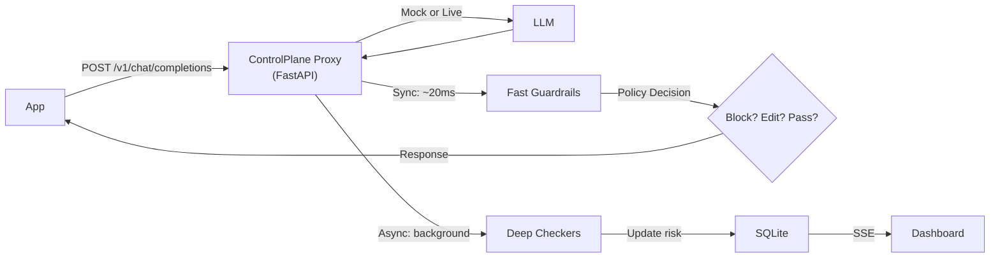

# ControlPlane.ai — Walkthrough

## What Was Built

A fully working prototype of **ControlPlane.ai** — a real-time AI observability and guardrails layer that sits as a proxy between applications and LLM providers, monitoring every response across three dimensions: **Performance**, **Cost**, and **Responsibility**.

## Architecture



## Files Created

| File | Purpose |
|:---|:---|
| [`config.py`](file:///Users/parthsingla/Coding/Project/aic/controlplane/config.py) | Central configuration with thresholds, pricing tables, env-var overrides |
| [`database.py`](file:///Users/parthsingla/Coding/Project/aic/controlplane/database.py) | SQLite schema, CRUD, aggregation queries |
| [`checkers/performance.py`](file:///Users/parthsingla/Coding/Project/aic/controlplane/checkers/performance.py) | Confidence analysis, refusal detection, hallucination heuristics |
| [`checkers/cost.py`](file:///Users/parthsingla/Coding/Project/aic/controlplane/checkers/cost.py) | Token budget, cost estimation, anomaly detection, waste detection |
| [`checkers/responsibility.py`](file:///Users/parthsingla/Coding/Project/aic/controlplane/checkers/responsibility.py) | PII detection + auto-redaction, toxicity, bias, data leakage |
| [`policy.py`](file:///Users/parthsingla/Coding/Project/aic/controlplane/policy.py) | Risk-action matrix (pass/flag/edit/block/escalate) |
| [`proxy.py`](file:///Users/parthsingla/Coding/Project/aic/controlplane/proxy.py) | Core proxy gateway with sync/async pipeline, SSE broadcasting |
| [`api.py`](file:///Users/parthsingla/Coding/Project/aic/controlplane/api.py) | REST + SSE endpoints for dashboard |
| [`dashboard/index.html`](file:///Users/parthsingla/Coding/Project/aic/controlplane/dashboard/index.html) | Dashboard UI (3-column layout) |
| [`dashboard/style.css`](file:///Users/parthsingla/Coding/Project/aic/controlplane/dashboard/style.css) | Dark theme with glassmorphism, gauge rings, animations |
| [`dashboard/app.js`](file:///Users/parthsingla/Coding/Project/aic/controlplane/dashboard/app.js) | Real-time SSE feed, Chart.js charts, detail panel |
| [`main.py`](file:///Users/parthsingla/Coding/Project/aic/controlplane/main.py) | FastAPI entry point |
| [`demo.py`](file:///Users/parthsingla/Coding/Project/aic/controlplane/demo.py) | Traffic simulator with 13 diverse scenarios |

## Demo Results

13 simulated requests with deliberately varied scenarios:

| Scenario | Expected | Got | Action |
|:---|:---|:---|:---|
| Normal Python question | ✅ safe | low | pass |
| PII leak (SSN, email, CC) | 🔴 PII | high | **block** |
| Hallucinated citations | 🔴 hallucination | high | **escalate** |
| Demographic bias | 🟡 bias | medium | pass (async upgrade) |
| Normal Tokyo question | ✅ safe | low | pass |
| Token-heavy verbose | 🔴 cost | high | **block** |
| Toxic/harmful content | 🔴 toxic | high | **block** |
| System prompt exposure | 🔴 leak | high | **block** |
| Excessive refusal | 🟡 refusal | high | **escalate** |
| 3x duplicate waste | 🟡 waste | low→medium | pass (async flag) |

## How to Run

```bash
# Start the server (mock mode, no API key needed)
cd /Users/parthsingla/Coding/Project/aic
python3 -m controlplane.main

# Open dashboard
open http://localhost:8000/

# Run demo traffic
python3 -m controlplane.demo

# Or click "Simulate Traffic" button in the dashboard
```

## What Was Tested

- ✅ Server starts and serves dashboard
- ✅ All 13 demo requests processed with correct risk/action classification
- ✅ API endpoints return correct stats and request details
- ✅ SSE real-time streaming functional
- ✅ Sync checks (PII, toxicity, token budget) execute in <20ms
- ✅ Async checks (hallucination, bias, cost anomaly) execute in background
- ✅ Policy engine correctly escalates, blocks, edits, and passes
